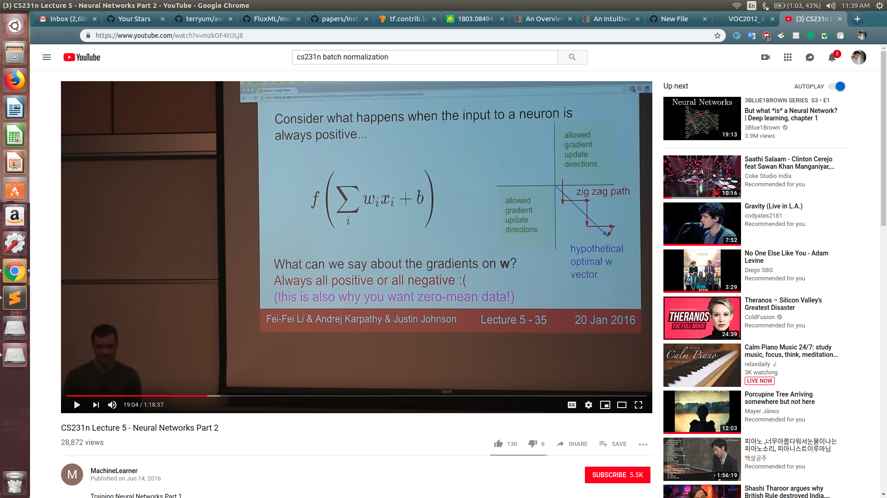

# Normalizations

<b>Why zero-centered data?</b>

If we consider sigmoid then we have the fact that the inputs to the next layer will belong only in [0,1]. Now, the gradients of the weights : $$\frac{\partial L}{\partial w) = \frac{\partial L}{\partial f) * x$$

Thus if x is always positive, the gradient of the weights will always be postivie or negative. Thus it may make a zig-zag path for converging into a non-optimal region of solution for the weights as seen in the slides.

This was just for intuition. To actually understand the math behind it, it is required to go through Natural Gradients and Fischer Matrices to understand why it is better.

Different Types Of Normalizations : 

https://arxiv.org/pdf/1803.08494.pdf

This paper explains different normalization techniques in short and group normalization in depth.

<b>References</b>

<a href="https://mlexplained.com/2018/11/30/an-overview-of-normalization-methods-in-deep-learning/">ML-explained-blog</a>

<a href="https://www.youtube.com/watch?v=mzkOF4tULj8">cs231n :)</a>
