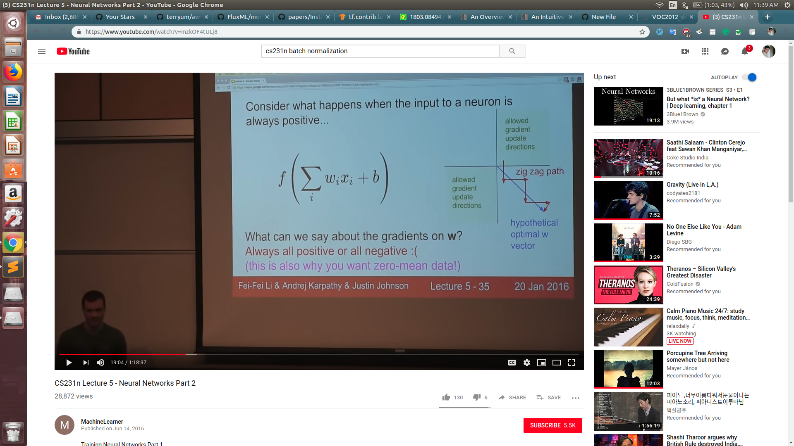

# Normalizations

<b>Why zero-centered data?</b>

If we consider sigmoid then we have the fact that the inputs to the next layer will belong only in [0,1]. Now, the gradients of the weights : $$\frac{\partial L}{\partial w) = \frac{\partial L}{\partial f) * x$$

Thus if x is always positive, the gradient of the weights will always be postivie or negative. Thus it may make a zig-zag path for converging into a non-optimal region of solution for the weights as seen in the slides.
